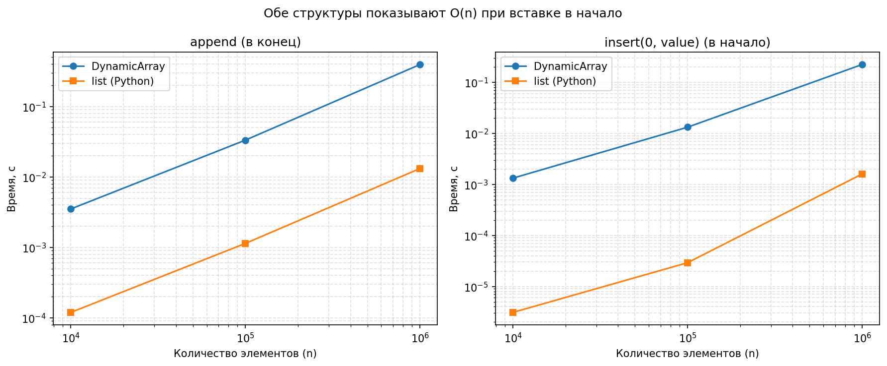
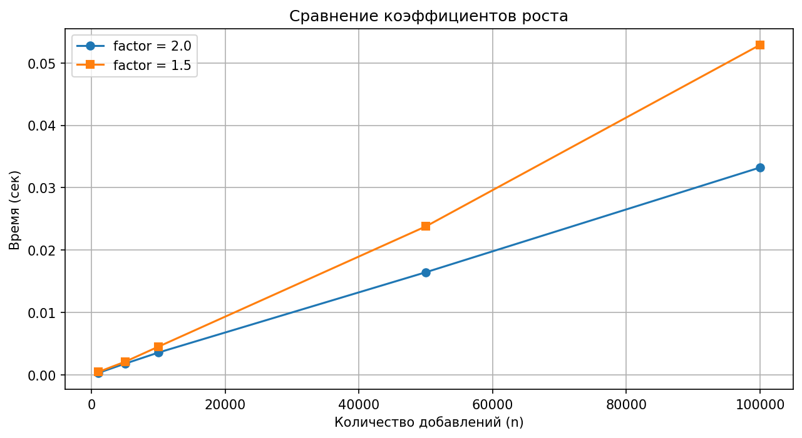

# Отчёт по лабораторной работе № 1

**Дисциплина:** Алгоритмы и структуры данных
**Тема:** Реализация массива и основных операций с ним

---

## 1. Цель работы

Реализовать с нуля (через классы, без использования встроенных контейнеров Python в
качестве основы) статический и динамический массивы, реализовать линейный и бинарный
поиск, провести замеры времени операций `append` и `insert(0, value)`, построить графики
и сравнить результаты с теоретической оценкой вычислительной сложности.

## 2. Выполненные пункты задания

- [x] Реализовать `StaticArray` и `DynamicArray`
- [x] Реализовать поиск (linear, binary)
- [x] Провести замеры времени (append, insert)
- [x] Построить графики и сравнить
- [x] Заполнить таблицу сложности
- [x] Оформить отчёт и загрузить в Git

## 3. Уровни выполнения

| Уровень | Что реализовано | Файл |
|---|---|---|
| 🥉 Бронза | `StaticArray`: `get`, `set`, `append`, `__len__`, `__str__` | `src/static_array.py` |
| 🥈 Серебро | `DynamicArray`: `append`, `get`, `insert`, `remove`, `find`, `binary_search`, авторасширение и сжатие | `src/dynamic_array.py` |
| 🥇 Золото | `DynamicArrayGold` с настраиваемым коэффициентом роста + эксперимент и график | `src/dynamic_array_gold.py` |

Оба массива построены на `ctypes.py_object` — это настоящий непрерывный блок памяти,
каждая ячейка которого хранит указатель на объект Python (`PyObject`).

## 4. Таблица вычислительной сложности

| Операция | Static Array | Dynamic Array | List (Python)\*\* |
|---|---|---|---|
| Доступ | O(1) | O(1) | O(1) |
| Вставка в конец | O(1)\* | O(1) амортизированное | O(1) амортизированное |
| Вставка в начало | O(n) | O(n) | O(n) |
| Вставка в середину | O(n) | O(n) | O(n) |
| Удаление из конца | O(1)\* | O(1) | O(1) |
| Удаление из начала | O(n) | O(n) | O(n) |
| Удаление из середины | O(n) | O(n) | O(n) |
| Поиск линейный | O(n) | O(n) | O(n) |
| Поиск бинарный | O(log n) | O(log n) | O(log n) |

\* Для статического массива — только при наличии свободного места (иначе `OverflowError`).

\*\* Встроенные контейнеры Python (`list`, `dict`, `set`) используются только для сравнения —
основные структуры данных реализованы самостоятельно, с нуля, через классы.

Обозначения: O(1) — константное время, O(n) — линейное, O(log n) — логарифмическое.

## 5. Методика замеров

Замеры выполнены в `benchmarks/benchmark.py` с помощью высокоточного таймера
`time.perf_counter()`. Каждое измерение повторялось **3 раза**, в таблицу занесено
**среднее значение**.

```python
def time_append(DS, n):
    ds = DS()
    start = time.perf_counter()
    for i in range(n):
        ds.append(i)
    return time.perf_counter() - start


def time_insert_front(DS, n):
    ds = DS()
    for i in range(n):
        ds.append(i)
    start = time.perf_counter()
    ds.insert(0, -1)
    return time.perf_counter() - start
```

Размеры: `n = [10 000, 100 000, 1 000 000]`. Сравнивались собственный `DynamicArray`
и встроенный `list` (Python).

Важно: `time_append` измеряет **весь цикл из n добавлений** (суммарно O(n) → амортизированная
O(1) на одну операцию), а `time_insert_front` — **одну вставку** в начало уже заполненного
массива из n элементов (O(n) на операцию).

## 6. Результаты замеров

### append (весь цикл из n добавлений)

| n | DynamicArray, с | list, с | во сколько раз медленнее |
|---|---|---|---|
| 10 000 | 0.003514 | 0.000119 | 29.4 |
| 100 000 | 0.033332 | 0.001139 | 29.3 |
| 1 000 000 | 0.394756 | 0.013170 | 30.0 |

### insert(0, value) — одна вставка в начало

| n | DynamicArray, с | list, с | во сколько раз медленнее |
|---|---|---|---|
| 10 000 | 0.001327 | 0.0000031 | 428.5 |
| 100 000 | 0.013236 | 0.0000292 | 453.6 |
| 1 000 000 | 0.224429 | 0.0016015 | 140.1 |

Полные численные данные — в `results/timings.csv`.

### График



## 7. Анализ результатов

**1. `append` растёт линейно от n.** При увеличении n в 10 раз суммарное время тоже растёт
примерно в 10 раз (0.0035 → 0.033 → 0.39 с). Значит, на **одну** операцию приходится
константное время — это и есть **амортизированная O(1)**. Расширения происходят редко
(при n = 1 000 000 их около log₂(1 000 000) ≈ 20), а суммарное копирование при удвоении
ёмкости составляет 1 + 2 + 4 + … + n/2 ≈ n элементов, то есть ≈ 2 операции на добавление.

**2. `insert(0, value)` растёт линейно от n — это O(n) на одну операцию.** Время одной
вставки увеличивается с 0.0013 с до 0.22 с при росте n в 100 раз, потому что приходится
сдвинуть вправо все n элементов. **Обе структуры показывают O(n) при вставке в начало** —
встроенный `list` устроен точно так же и от сдвига не спасает, он лишь выполняет его
в оптимизированном C-коде.

**3. Собственный массив медленнее `list` в ~30 раз (append) и в 140–450 раз (insert).**
Это разница не в асимптотике, а в константе: `list` реализован на C (сдвиг делается
через `memmove`), а наш цикл сдвига выполняется интерпретатором Python. Асимптотика
у обеих структур одинаковая — прямые на графике в логарифмическом масштабе параллельны.

**4. Вывод по классу задач.** Массив хорош там, где нужен быстрый доступ по индексу
и добавление в конец. Для частых вставок и удалений в начале/середине массив —
неподходящая структура (нужен связный список или дек).

## 8. Золотой уровень: коэффициент роста

`DynamicArrayGold(growth_factor)` расширяется не строго в 2 раза, а в `growth_factor` раз:
`new_capacity = int(_capacity * growth_factor) + 1`.

Результаты эксперимента (`python src/dynamic_array_gold.py`):

| n | factor 2.0, с | factor 1.5, с | разница, % |
|---|---|---|---|
| 1 000 | 0.000313 | 0.000472 | −33.7 |
| 5 000 | 0.001799 | 0.002106 | −14.6 |
| 10 000 | 0.003581 | 0.004528 | −20.9 |
| 50 000 | 0.016448 | 0.023796 | −30.9 |
| 100 000 | 0.033235 | 0.052890 | −37.2 |



**Интерпретация.** Коэффициент 2.0 стабильно быстрее на 15–37 %: чем больше коэффициент,
тем реже происходит расширение. На 100 000 добавлений при factor = 2.0 расширений
около log₂(100 000) ≈ 17, при factor = 1.5 — около log₁.₅(100 000) ≈ 29, и каждое
расширение копирует все элементы.

Обратная сторона — память. При factor = 2.0 массив может занимать до 2 раз больше памяти,
чем нужно (размер 17 → ёмкость 32, почти 50 % простаивает). При factor = 1.5 «вилка»
меньше: размер 17 → ёмкость ≈ 25, простаивает около 30 %.

**Инженерный компромисс:** много памяти и нужна скорость — 2.0; память ограничена
(мобильные и встраиваемые системы) — 1.5. В Python `list` использует собственный механизм
(примерно 1/16 от размера плюс гарантированный минимум) — это оптимизация под кэш процессора.

## 9. Ответы на ключевые вопросы

**Почему `append` — амортизированная O(1)?**
При каждом расширении ёмкость удваивается, поэтому расширения происходят всё реже.
Суммарное копирование за n добавлений: 1 + 2 + 4 + … + n/2 ≈ n элементов, то есть
в среднем константа на одну операцию.

**Почему при `insert` сдвиг идёт справа налево?**
Чтобы не затереть ещё не скопированные элементы. Пример: `[A, B, C]`, вставляем X
на позицию 1. Правильно: копируем C на позицию 3, затем B на позицию 2. Если идти
слева направо — B перезапишет C, и C будет потерян.

**Почему при `remove` сдвиг идёт слева направо?**
Симметрично: перезаписываем удаляемый элемент следующим за ним, затем следующий —
следующим за ним. `[A, B, C, D]`, удаляем индекс 1: `arr[1] = arr[2]`, затем `arr[2] = arr[3]`.

**Почему сжатие происходит при `_size == _capacity // 4`, а не при 1/2?**
При пороге 1/2 циклические операции (добавили один элемент → расширение, удалили один →
сжатие) заставляли бы массив постоянно реаллоцироваться. Порог 1/4 создаёт «запас»
(гистерезис), и после сжатия до половины ёмкости остаётся место для новых добавлений
без немедленного расширения.

**Линейный или бинарный поиск?**
Линейный — O(n), работает всегда. Бинарный — O(log n), но требует отсортированного
массива. Для массива из 1 млн элементов: линейный ≈ 0.01 с, бинарный ≈ 0.00001 с.

## 10. Вывод

Реализованы статический и динамический массивы на «сырой» памяти (`ctypes.py_object`)
со всеми требуемыми операциями и обоими алгоритмами поиска. Экспериментальные замеры
подтвердили теоретические оценки: `append` — амортизированная O(1), `insert(0, value)` —
O(n), причём это свойство самой структуры данных, а не конкретной реализации: встроенный
`list` показывает ту же асимптотику, отличаясь лишь константой (реализация на C).
Эксперимент с коэффициентом роста показал компромисс «скорость против памяти»:
2.0 быстрее, 1.5 экономнее.
